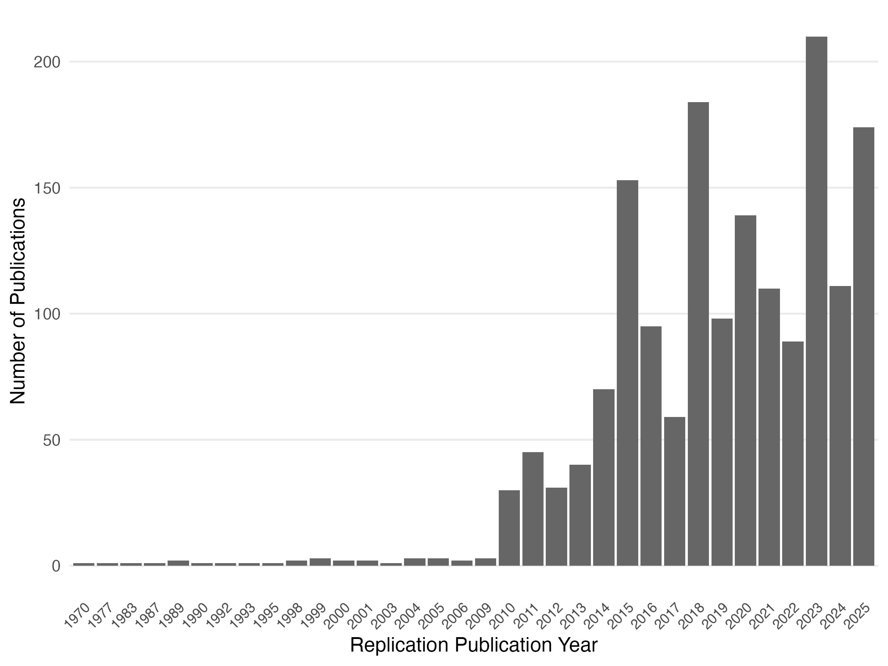

“*The proof established by the test must have a specific form, namely, repeatability. The issue of the experiment must be a statement of the hypothesis, the conditions of test, and the results, in such form that another experimenter, from the description alone, may be able to repeat the experiment. Nothing is accepted as proof, in psychology or in any other science, which does not conform to this requirement*.” – [@Dunlap1926]

Repeatability is the cornerstone of many sciences: Although scientific claims are often assumed to be robust, without explicit reproduction and replication — that is, retesting a hypothesis with the same (reproduction) or different (replication) data — it remains unclear whether this assumption holds.

Cumulative science without repetition is costly: building on unreliable findings leads to research waste and misdirected effort. The aim of this guide is to empower researchers to conduct high-quality reproductions and replications and thereby contribute to making their fields of research more cumulative and robust. Issues of replicability have been discussed across many disciplines, such as psychology [@OpenScienceCollab2015], economics [@DreberJohannesson2024], biology [@ErringtonEtAl2021b], marketing [@UrminskyDietvorst2024], linguistics [@McManus2024], computer science [@HummelManner2024] and epidemiology [@LashEtAl2018] and the number of replications has been rising sharply (see @fig-replication-growth, which shows replications only as there is no comprehensive database for reproductions yet).

{#fig-replication-growth}

While the number of replication and reproduction studies has increased, the overall proportion of them is still very small, with reviews finding that replications make up well below 1% of published papers [@PerryEtAl2022]. Moreover, much of the guidance on replications is still being developed [@ClarkeEtAl2024] and in narrow parts of science, which leads to fragmentation, siloing, and potentially inconsistent information.

Here we attempt to integrate useful guidelines [e.g., @BlockKuckertz2018; @JekelEtAl2020] into a comprehensive overview that allows diverse fields to profit from each other. In sum, this guide provides information about the entire process of research allowing researchers at all career stages to plan, conduct, and publish reproduction and replication studies. We limit our scope to quantitative research, given that the concept of reproducibility and replicability itself is highly contested among qualitative researchers [see @MakelEtAl2012; @ColeEtAl2024; @Pownall2022; @Bennett2021].
